**Mount Pleasant, Vancouver** — A 26-year resident of Mount Pleasant was
recently forced out of her long-time home under circumstances that have left
many in the community outraged. The landlord, who has publicly been called a
"steward" of the community,
allegedly harassed and pressured the elderly tenant, ultimately forcing her to
leave in pursuit of higher rent.

### A Tenant’s Ordeal

For over two decades, the tenant, a woman in her 70s, lived in her unit without any significant issues. The problems began in 2019, shortly after she became a widow. At that time, the landlord requested a voluntary rent increase far above the legal limit. Living on a fixed income and recently bereaved, the tenant refused the $445 increase. Following this refusal, she claims the landlord embarked on a campaign of harassment designed to push her out of her home.

### Key Facts:

- **Stable Tenancy:** The tenant lived peacefully in her unit for over 20 years without incident until 2019.

- **The Rent Increase:** In 2019, shortly after becoming a widow, the landlord
  sent a letter to all tenants asking them to **voluntarily** accept a $445 rent
  increase. As the request was described as voluntary, it was considered legal
  despite being significantly above the
  legal limit [EVIDENCE 1].

- **Harassment Claims:** Living on a fixed income and recently bereaved, the
  tenant refused the $445 increase. Following this, the tenant reports that the
  landlord and his family subjected her to verbal abuse, threats of eviction,
  and invasion of her privacy. Newspaper clippings highlighting rising rent
  prices were posted outside her door, allegedly to pressure her into moving out
  [EVIDENCE 2].

- **Notice of Eviction:** On June 31, 2024, the landlord served the tenant with an eviction notice, claiming the unit was needed for a family member to occupy.

- **Dispute Submission:** On July 16, 2024, the tenant formally disputed the eviction notice, arguing that it was issued in bad faith [EVIDENCE 3].

- **BC Law:** Under British Columbia's Residential Tenancy Act (RTA), a landlord may end a tenancy to house a family member, but this must be done in "good faith." Legal precedents, such as *Gichuru v Palmar Properties Ltd.*, emphasize that the landlord's intent must be honest and free from ulterior motives [EVIDENCE 4].

- **Legal Withdrawal:** The tenant withdrew her dispute because the hearing was scheduled for September 10, just 10 days after the eviction notice was set to take effect. Current laws do not provide clarity on how long she would have to move out if she lost the case, creating a situation where she had to begin looking for new housing immediately. To secure another apartment, she had to pay the first month’s rent in advance. This left her in a difficult position: if she won the dispute, she would be forced to pay double rent; if she lost and hadn’t secured another apartment, she faced imminent homelessness. Caught between these two untenable options, she felt compelled to withdraw her dispute [EVIDENCE 5].

- **New Listing:** On the same day that the tenant withdrew her dispute, the landlord listed another unit in the same complex on Craigslist. This raised further questions about the landlord’s claim that the eviction was necessary to provide housing for a family member [EVIDENCE 6].

### The Full Story

For over 26 years, the tenant lived in her Mount Pleasant home, enjoying
stability and a strong sense of community. In 2019, the landlord asked all
tenants in the building to voluntarily accept a $445 rent increase—an amount
well above the legal limit but technically allowed since it required tenant
approval. The tenant, whose husband had recently passed away, declined the
increase due to her fixed income and the emotional and financial strain of her
loss.

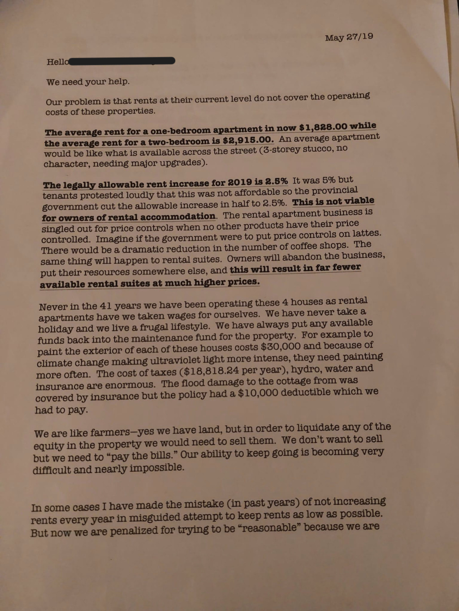{: .align-left .img-50}  
<figcaption></figcaption>
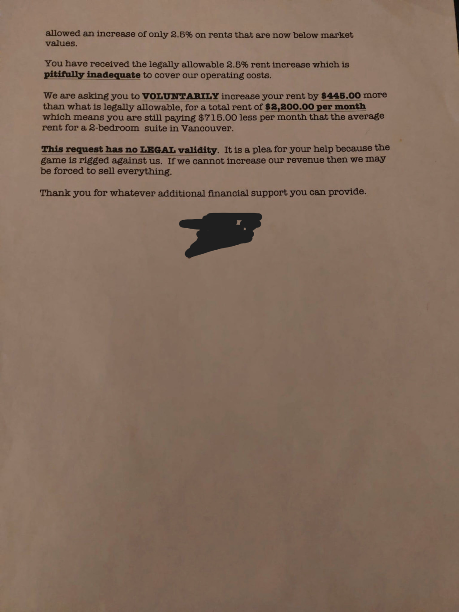{: .align-right .img-50}  
<figcaption></figcaption>

After her refusal, the tenant claims that her once-secure living situation began
to deteriorate. According to her, the landlord and his family initiated a
campaign of intimidation and harassment. Photos, text messages, entries from the
tenant's personal journal, and eyewitness statements all submitted as evidence
for the dispute resolution hearing suggest a systematic
effort to pressure her into leaving.

"She can roll around in the grave for all I care."

One of the alleged tactics involved placing newspaper clippings with bold headlines about rising rents on a desk just outside the tenant's door, with highlighted sections emphasizing the gap between her rent and current market rates. The landlord did not deny posting the clippings, stating in evidence submitted for dispute resolution, "I can post whatever I want." The message was clear: she was paying too little, and her continued presence was unwelcome [EVIDENCE 2].

  

      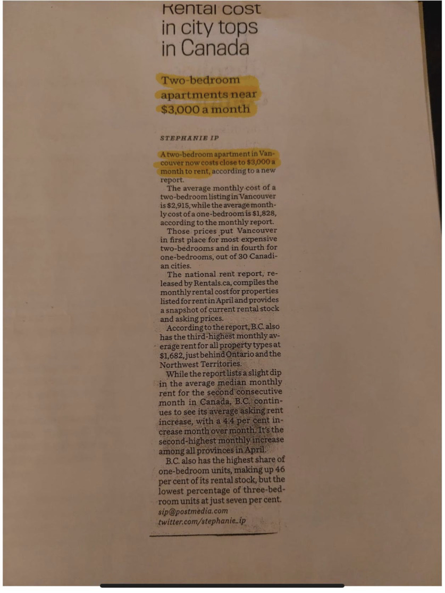
    <figcaption>A photo of one of the newspaper clippings posted outside of the tenant's door. The landlord highlighted the relevant sections to remove any confusion about the intended message.</figcaption>
  

  

    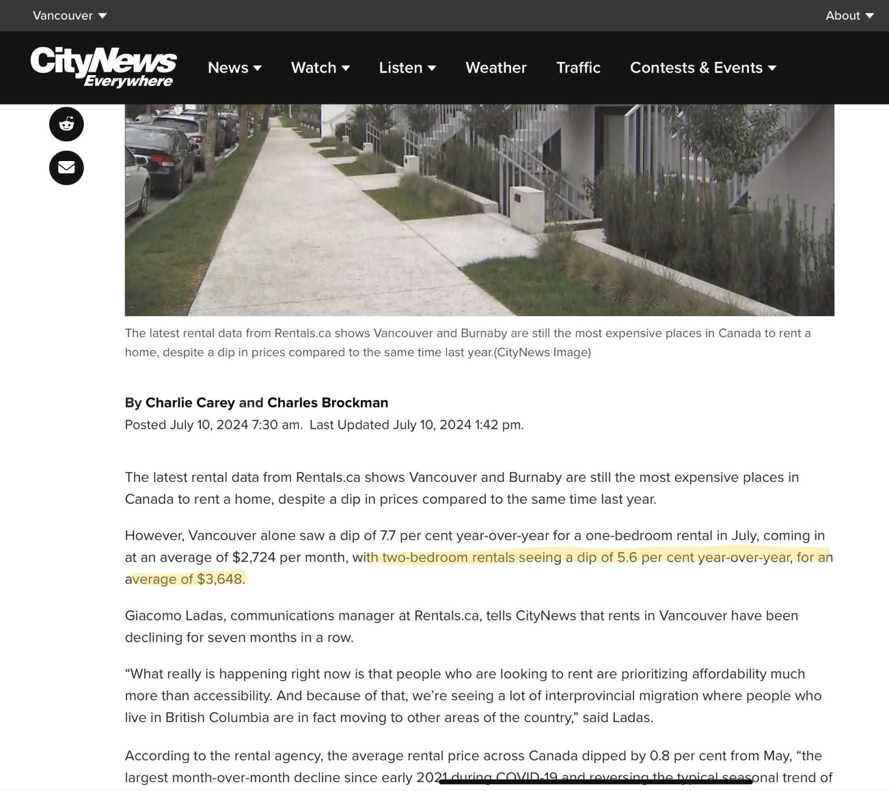
    <figcaption>One of the news articles the landlord pinned outside of the tenant's door, discussing average rent in Vancouver.</figcaption>
  

The landlord did not deny posting the clippings in the evidence they submitted for the dispute resolution, stating "I can post whatever I want."
The message was clear: she was paying too little, and her continued residence was unwelcome.

Here’s the revised passage with the added detail about the journal entries being provided as evidence in the hearing:

Entries in the tenant's personal journal document multiple instances of verbal harassment by the landlord's daughter. These incidents were recorded at the time they occurred, and screenshots of the journal entries were later submitted as evidence in the dispute resolution hearing.

In one encounter, the daughter allegedly confronted the tenant in the laundry
room, calling her a "c*nt" and stating, "Nobody wants you here" [EVIDENCE 5].
In another incident, the daughter reportedly told the tenant, "I will do
anything to protect my family," [EVIDENCE 7] and later expressed her displeasure over the
tenant's refusal to pay the voluntary rent increase, saying, "When they asked
people for a voluntary rent increase, everybody did except for [REDACTED] and
me" [EVIDENCE 10]. The landlord did not address these allegations in his evidence.

  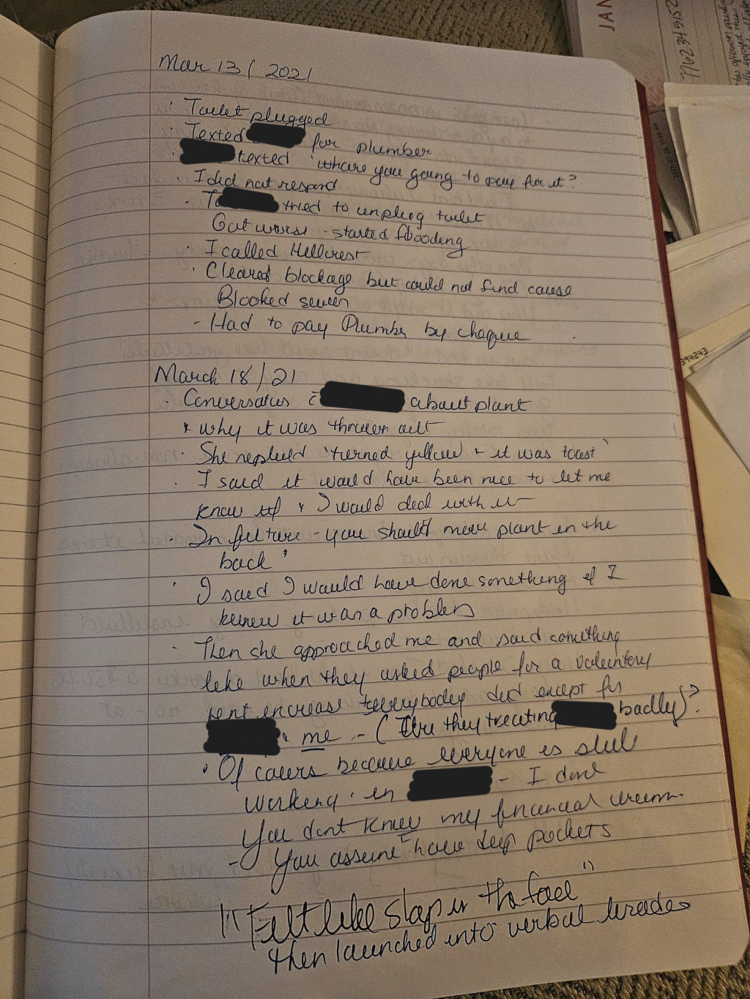
  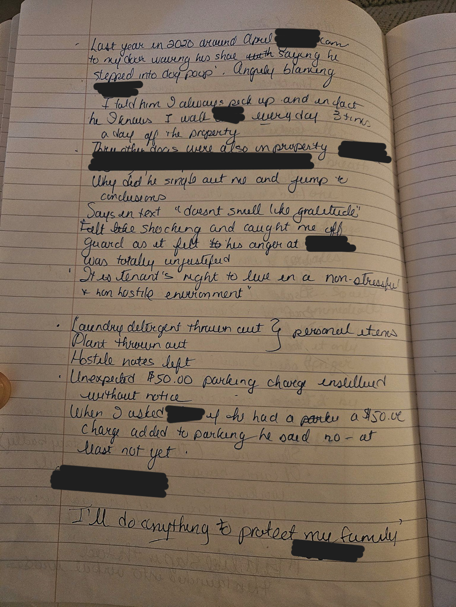
  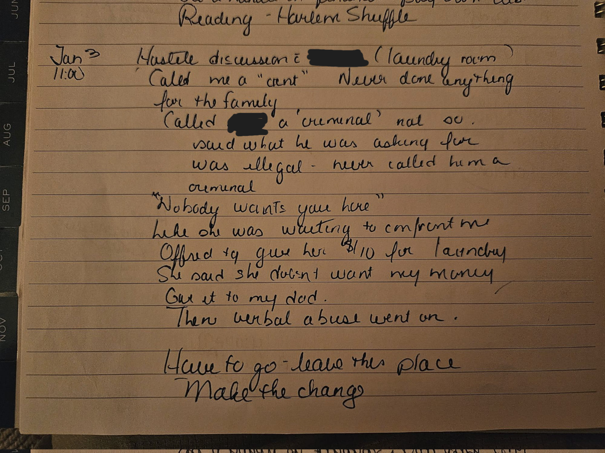

<figcaption>(Left) The tenant's journal entries submitted as evidence to the dispute resolution hearing describing how the landlord's daughter expressed displeasure over the refusal to pay the voluntary rent increase. (Center) The daughter reportedly told the tenant, "I will do anything to protect my family". (Right) The daughter allegedly confronted the tenant in the laundry room, calling her a "c*nt" and stating, "Nobody wants you here".</figcaption> 

As time passed, the alleged harassment escalated. The tenant recounts one particularly distressing incident involving the landlord's brother, who is also an associate in the family business. During a small dinner party with friends, the landlord's brother allegedly entered her unit without permission. The tenant’s testimony, submitted as evidence in the dispute resolution hearing, details the incident:

“I was having a small dinner party with [two friends] at my house, playing
Christmas music. We were laughing and having a good time. Suddenly, [the
landlord’s brother] opens my back door and says to me, ‘Tone it down, [Tenant].’
He came right into the kitchen. I was sitting at my dining room table. Simply
opened the door, entered, and said this. Then he was about to leave, turned
around and said, ‘If you don’t tone it down, I’ll ask you to leave.’” [EVIDENCE
6]

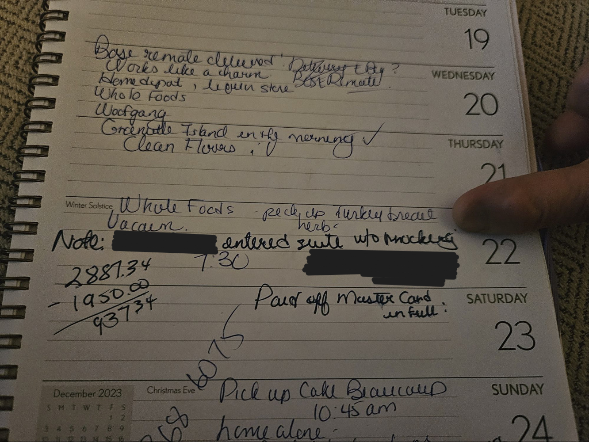{: .align-center .img-75}  
<figcaption></figcaption>

This incident, where the landlord's brother allegedly entered her home uninvited and issued threats, left the tenant feeling deeply unsettled and intimidated.

The tenant also provided written testimony about the frequent threats of
eviction she received from the landlord, documented in phone screenshots, which
she claims were used to intimidate and harass her. The landlord did not address
these allegations in his evidence.

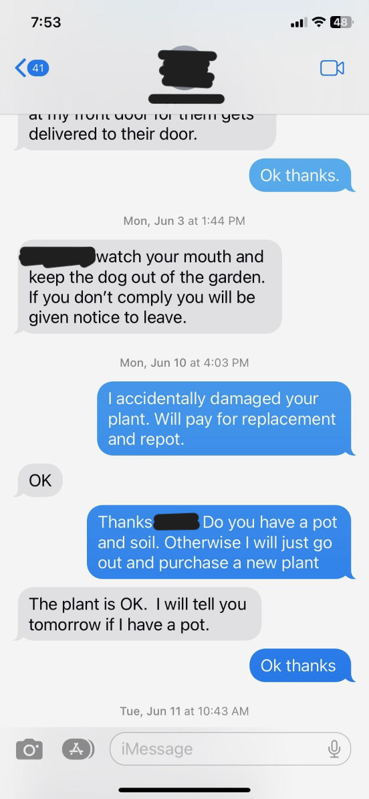{: .align-center .img-75}  
<figcaption></figcaption>

Neighbors also noticed the harassment. The tenant's upstairs neighbor submitted two signed testimonies describing how, on separate occasions, the landlord and his brother expressed disdain for the tenant. In one instance, on October 31, 2022, the landlord's brother allegedly remarked, "We like you guys, but please just be aware it's an old wooden building and the noise travels easily. I mean, I don’t care about the tenant downstairs—she can roll around in the grave for all I care—but we don't want to disturb [the other neighbor]."

On June 22, 2024, the brother reportedly stated, "I don't give a shit about
her." The landlord did not dispute the June 22nd quote in the submitted evidence
but denied making the earlier remark, claiming the witness was inebriated at the
time. However, the testimony referred to an incident on October 31, 2022, not
June 22, 2024, making the landlord's defense irrelevant.

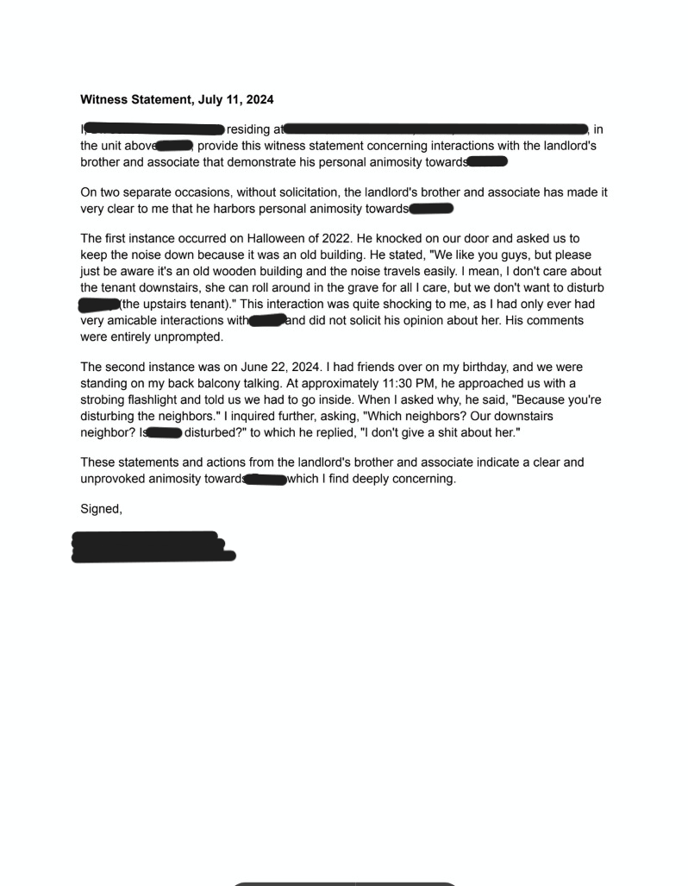{: .align-center .img-50}  
<figcaption></figcaption>

As the alleged harassment intensified, the tenant began to feel increasingly
unsafe in her long-time home. Matters escalated further on June 31, 2024, when
she was served with an eviction notice. The landlord claimed that the unit was
needed for a family member—a rationale that the tenant and her supporters
questioned.

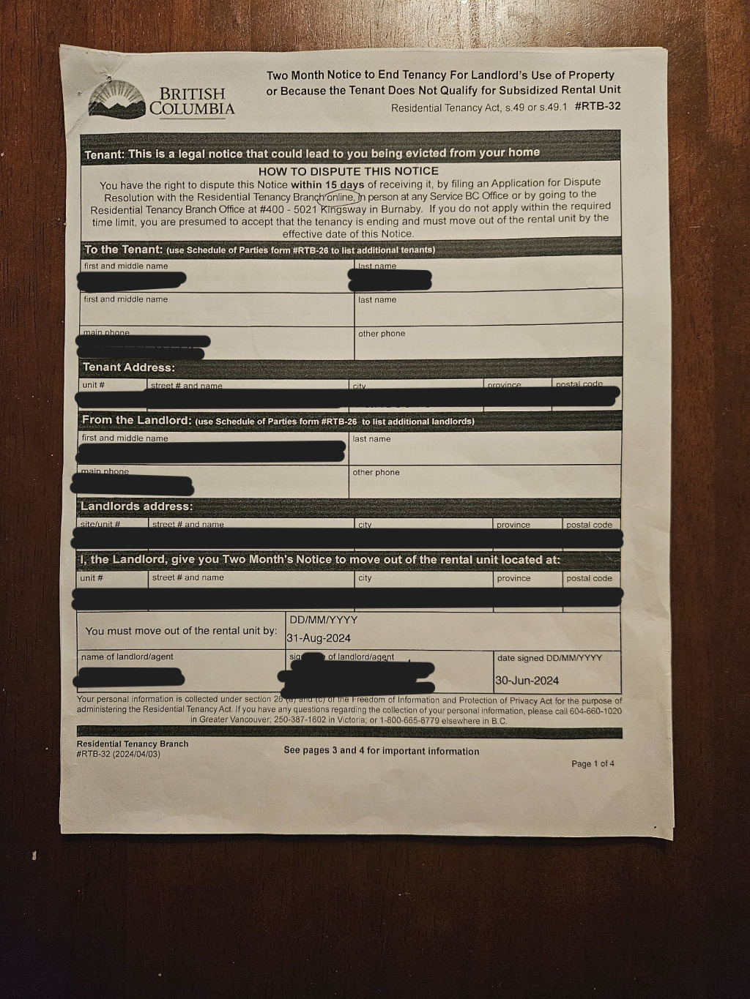{: .align-center .img-75}  
<figcaption></figcaption>

### The Dispute Resolution Hearing

On July 16, 2024, the tenant formally disputed the eviction notice, arguing that it was issued in bad faith. However, the legal framework offered little reassurance. The hearing was set for September 10, just 10 days after the eviction notice was to take effect. If she lost, she faced immediate homelessness with no clear timeline for vacating. If she secured another apartment in the meantime, she risked having to pay double rent—a financial burden she could not afford .

Facing these overwhelming challenges, the tenant felt compelled to withdraw her
dispute. Her concerns were validated when, on the very day she withdrew, the
landlord listed another unit in the same complex on Craigslist. This raised
further doubts about the landlord’s stated need to house a family member and
suggested a calculated effort to replace a long-term tenant with someone who
could pay more.

{: .align-center .img-75}  
<figcaption></figcaption>

### The Law and Its Limits

According to the Residential Tenancy Act (RTA) in British Columbia, landlords may end a tenancy to house a family member, but it must be done in “good faith.” In this case, the tenant’s withdrawal highlights a significant gap in tenant protections: there is no clear law dictating how long a tenant has to vacate after losing an eviction dispute, leaving her in a precarious situation.

### Broader Implications

This experience is not unique. In Vancouver’s competitive rental market, long-term tenants, particularly seniors, face increasing pressure as landlords seek to maximize profits by replacing them with tenants who can pay higher rents. This case raises serious concerns about housing insecurity for vulnerable populations in the city.

### Call to Action

The Mount Pleasant community must demand accountability from landlords who exploit their tenants. Residents are urged to contact local officials and advocate for stronger tenant protections, ensuring that no one else has to endure what this tenant has experienced.

### Get Involved

- **Learn More:** Visit [Local Tenant Rights Organization] to understand your rights and how to protect them.
- **Support the Tenant:** Share her story and join the call for better housing protections in Vancouver.

### Conclusion

This story is a stark reminder of the power imbalance in the rental market and the urgent need for reform. The actions of a landlord who claims to be a community steward have instead become a disgrace to Mount Pleasant, highlighting the vulnerability of long-term tenants in a city where affordable housing is increasingly out of reach.
